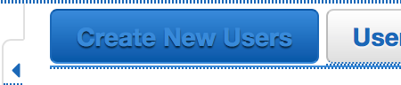
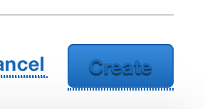
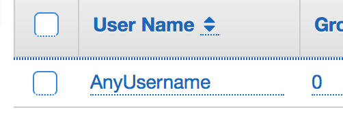
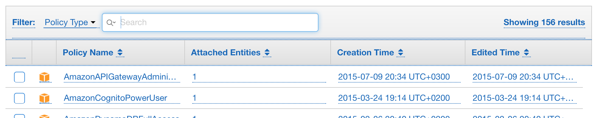
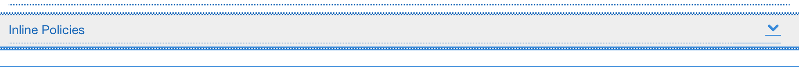
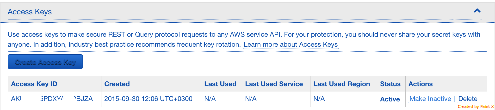

Creating secured AWS credentials
--------------------------------

In order to avoid excessive bills in case your AWS account get hacked
you may create secured credentials that suits DEEP requirements.

The AWS Services we are giving access to:
 - [Lambda](https://aws.amazon.com/lambda/)
 - [ElastiCache](https://aws.amazon.com/elasticache/) (disabled until VPC is available in lambdas)
 - [S3](https://aws.amazon.com/s3/)
 - [DynamoDB](https://aws.amazon.com/dynamodb/)
 - [CloudFront](https://aws.amazon.com/cloudfront/)
 - [APIGateway](https://aws.amazon.com/api-gateway/)
 - [Cognito](https://aws.amazon.com/cognito/)
 - [IAM](https://aws.amazon.com/iam/)
 
The steps
=========

 - Sign in to the `AWS Console`

 - Choose `IAM` service from the `Services` dropdown

 - Choose `Users` from the sidebar

 - Click the `Create New Users` button

 - Enter an username in one of the `Enter User Names` text fields

 - Click `Create` at the bottom of the page

 - Click on the `Hide User Security Credentials` spoiler link and SAVE your security credentials

 - Click on the `Close` button TWICE at the bottom of the page

 - Click on your user from the user list

 - Click on the `Attach Policy` button from the `Permissions` section

 - Select the following items from the list of `Policy Name`s:
   - [AWSLambdaFullAccess](https://console.aws.amazon.com/iam/home?region=us-west-2#policies/arn:aws:iam::aws:policy/AWSLambdaFullAccess)
   - [AmazonElastiCacheFullAccess](https://console.aws.amazon.com/iam/home?region=us-west-2#policies/arn:aws:iam::aws:policy/AmazonElastiCacheFullAccess)
   - [AmazonS3FullAccess](https://console.aws.amazon.com/iam/home?region=us-west-2#policies/arn:aws:iam::aws:policy/AmazonS3FullAccess)
   - [AmazonDynamoDBFullAccess](https://console.aws.amazon.com/iam/home?region=us-west-2#policies/arn:aws:iam::aws:policy/AmazonDynamoDBFullAccess)
   - [CloudFrontFullAccess](https://console.aws.amazon.com/iam/home?region=us-west-2#policies/arn:aws:iam::aws:policy/CloudFrontFullAccess)
   - [AmazonAPIGatewayAdministrator](https://console.aws.amazon.com/iam/home?region=us-west-2#policies/arn:aws:iam::aws:policy/AmazonAPIGatewayAdministrator)
   - [AmazonCognitoPowerUser](https://console.aws.amazon.com/iam/home?region=us-west-2#policies/arn:aws:iam::aws:policy/AmazonCognitoPowerUser)
   
 

 - Click on the `Attach Policy` button at the bottom of the page

 - Go to the `Inline Policies` section and click on the arrow from the right side to open the spoiler

 - Click on the `click here` link inside the `Inline Policies` spoiler

 - Select the `Custom Policy` list item and than on the appeared `Select` button

 - Copy the content of [secured IAM policy](assets/aws-secure-deep-policy.json) into the `Policy Document` text area

 - Type a name for the policy in `Policy Name` text field

 - Click on the `Apply Policy` button from the bottom of the page

 - Done!

> Using credentials in the [deploy config](../tools/deploy.md#example-of-deeployjson)

> If your credentials were compromised you can make them inactive by clicking `Make Inactive` link
> from the `Actions` section in `Access Keys` of the chosen user 