Creating secured AWS credentials
--------------------------------

In order to avoid excessive bills in case your AWS account get hacked
you may create secured credentials that suits DEEP requirements.

The AWS Services we are giving access to:
 - [Lambda](https://aws.amazon.com/lambda/)
 - [ElastiCache](https://aws.amazon.com/elasticache/) (disabled until VPC is available in lambdas)
 - [S3](https://aws.amazon.com/s3/)
 - [DynamoDB](https://aws.amazon.com/dynamodb/)
 - [CloudFront](https://aws.amazon.com/cloudfront/)
 - [APIGateway](https://aws.amazon.com/api-gateway/)
 - [Cognito](https://aws.amazon.com/cognito/)
 - [IAM](https://aws.amazon.com/iam/)
 - [SQS](https://aws.amazon.com/sqs/)
 - [ES](https://aws.amazon.com/elasticsearch-service/)

The steps
=========

 - Sign in to the `AWS Console`

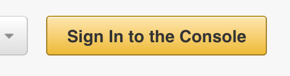

 - Choose `IAM` service from the `Services` dropdown

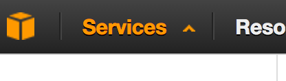

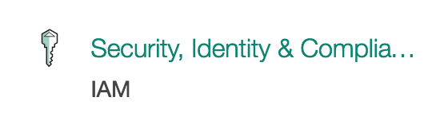

 - Choose `Users` from the sidebar

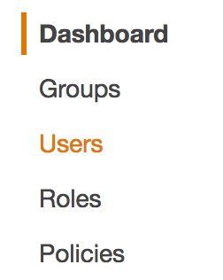

 - Click on the `Add User` button

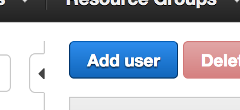

 - Enter an username into the `User name` text field

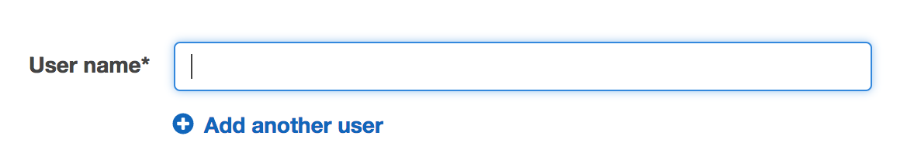

 - Check the `Programmatic access` option in the `Access type` area

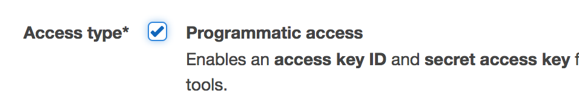

 - Click on `Next: Permissions` at the bottom of the page

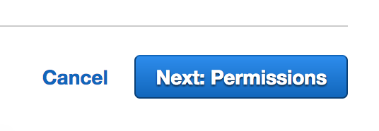

 - Select the `Attach existing policies directly` option

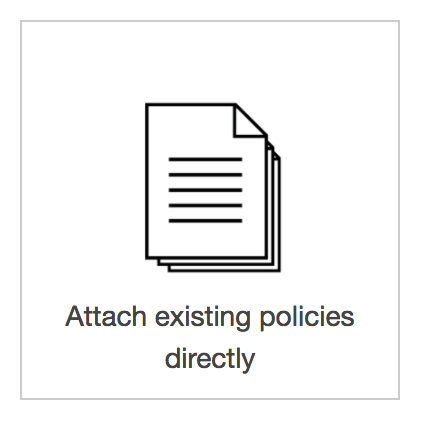

 - Click on `Create Policy` button

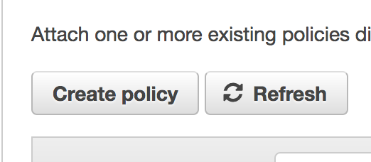

 - In the new opened tab click on `Connect` button for `Create Your Own Policy` option

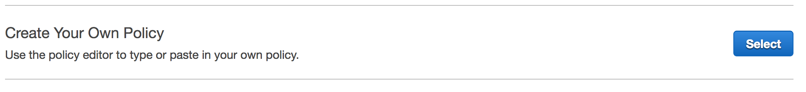

 - Type a name for the policy in `Policy Name` text field

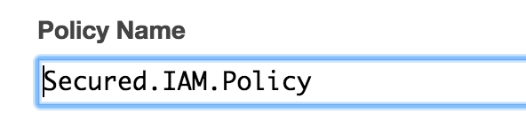

 - Copy the content of [secured IAM policy](assets/aws-secure-deep-policy.json) into the `Policy Document` text area

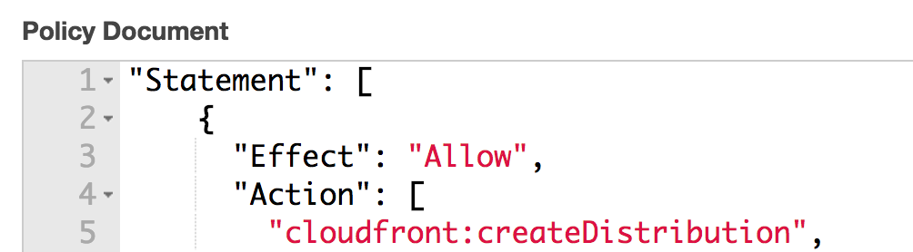

 - Click on `Create Policy` button

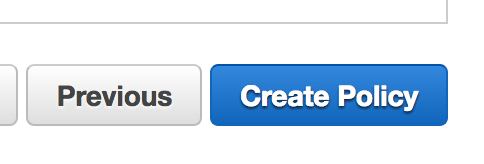

 - Switch back to the `Add user` tab and click on `Refresh` button

 - Select the newly created policy from the list

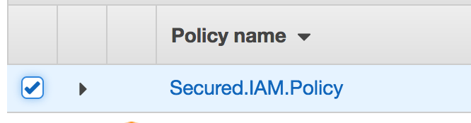

 - Click on the `Next: Review` button

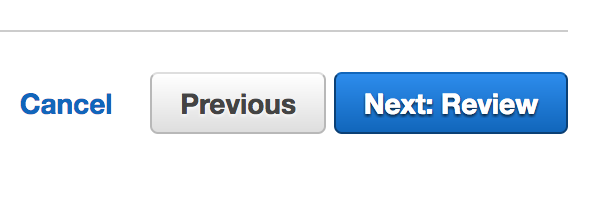

 - Click on the `Create user` button at the bottom of the page

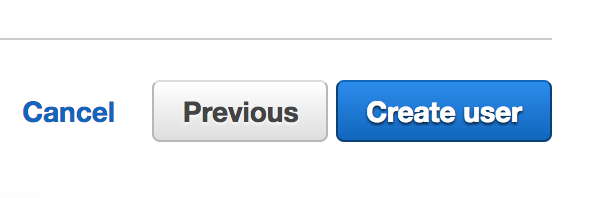

 - Click on the `Download .csv` button to save the credentials

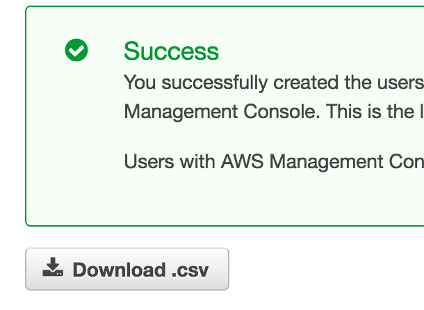

 - Done!

> Using credentials in the [deploy config](../tools/deploy.md#example-of-deeployjson)

> If your credentials were compromised you can make them inactive by clicking `Make inactive` link
> from the `Status` section in `Access Keys` of the chosen user 

